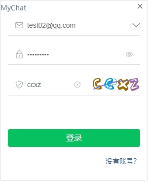
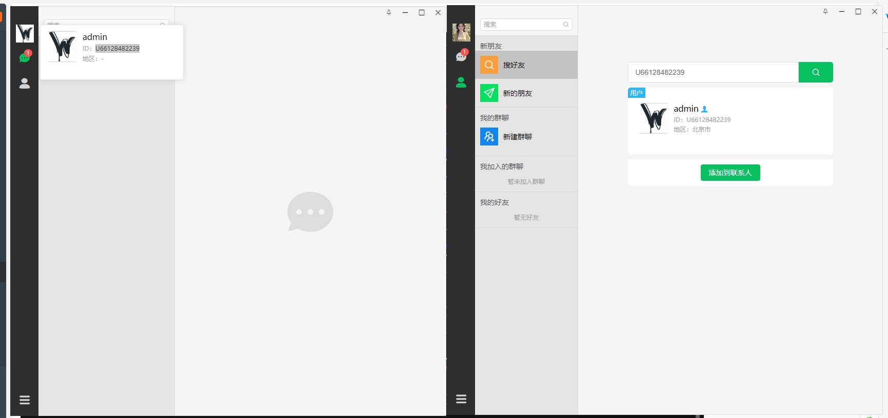
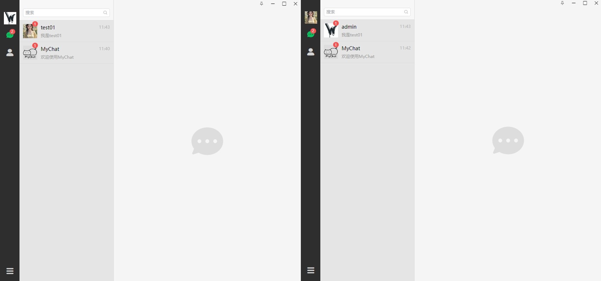
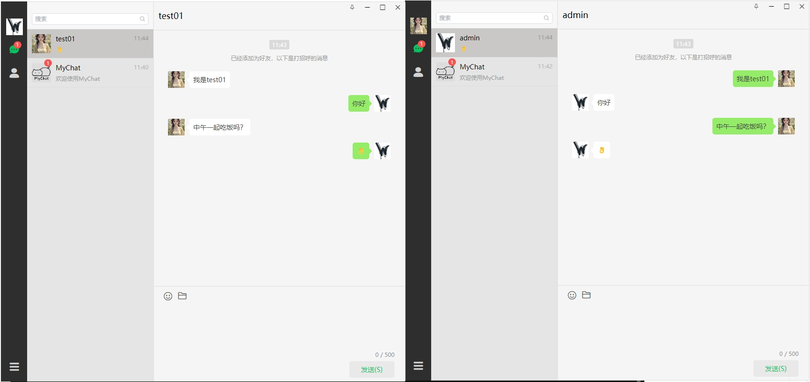
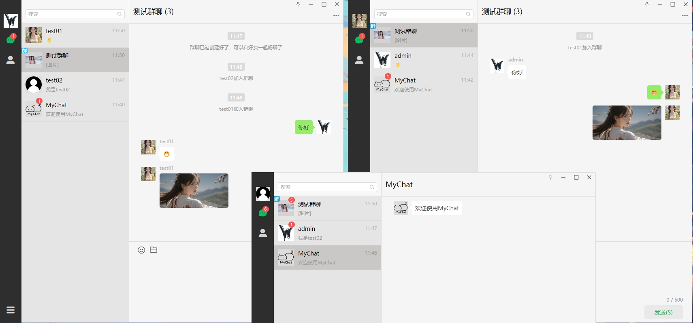
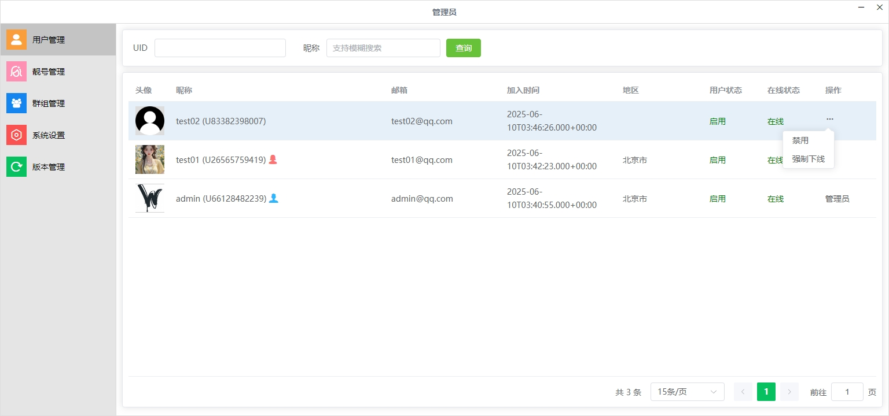
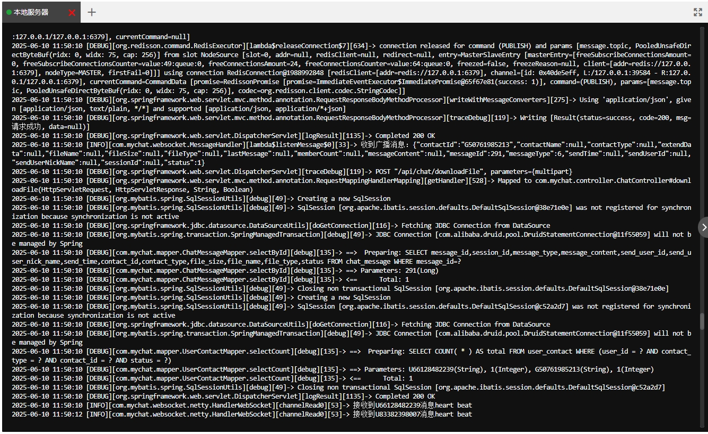

# MyChat-仿微信实时聊天通信项目-服务端

MyChat是一个基于Java技术栈的仿微信实时聊天通信系统，提供单聊、群聊、消息推送、媒体文件发送下载查看等核心功能。

- **客户端**: [MyChat-Client](https://github.com/SoulGoodman-coder/MyChat-Client) (Electron/Vue实现)

## 技术栈

- **后端框架**: Spring Boot 3.x
- **网络通信**: Netty 4.x (TCP长连接)
- **ORM框架**: MyBatis-Plus 3.5.x
- **数据库**: MySQL 8.0 + Redis 7.0
- **认证授权**: Token
- **其他**: Lombok等工具库

## 功能特性

### 核心功能
- 用户注册/登录/个人信息管理
- 好友关系管理（添加/删除/查找）
- 单聊消息实时收发
- 群组创建/管理
- 群聊消息广播
- 消息已读未读状态
- 历史消息查询
- 媒体文件发送下载查看

### 高级特性
- 心跳检测保持长连接
- 离线消息存储
- WebSocket协议支持

## 项目截图

## 开源协议

GNU General Public License v3.0 (GPLv3)

本项目采用 **GPLv3** 许可证，您必须遵守以下条款：

1. 任何衍生作品必须**保持相同许可证**
2. 必须公开修改后的**完整源代码**
3. 需明确标注**原始版权声明**
